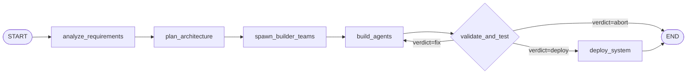

# Architecture — OpenClaw Teams

## System Overview

OpenClaw Teams is a hierarchical multi-agent build platform. It accepts a natural-language description of what to build and autonomously drives a six-node LangGraph pipeline that analyses requirements, designs architecture, spawns agent teams, builds artifacts, validates them, and produces a deployment-ready plan.

---

## Agent Hierarchy

```
┌─────────────────────────────────────────────────────────────────────┐
│                         BUILDER LAYER                                │
│                                                                       │
│  ClawWorld Builder (claude-opus-4-6)                                 │
│  "Top-level orchestrator. Receives user intent, drives the           │
│   LangGraph pipeline, aggregates final artifacts."                   │
└──────────────────────────────┬──────────────────────────────────────┘
                               │ spawns
              ┌────────────────┼────────────────┐
              │                │                │
   ┌──────────▼───────┐ ┌──────▼──────┐ ┌──────▼──────────┐
   │ Agent Builder    │ │Skill        │ │Routing Optimizer│
   │ Supervisor       │ │Optimizer    │ │Supervisor       │
   │ (sonnet-4-6)     │ │Supervisor   │ │(sonnet-4-6)     │
   └──────┬───────────┘ └──────┬──────┘ └──────┬──────────┘
          │                   │               │
   ┌──────▼──────┐     ┌──────▼──────┐ ┌──────▼──────┐
   │ agent-      │     │skill-       │ │routing-     │
   │ creator     │     │analyzer     │ │tester       │
   │             │     │             │ │             │
   │ skill-      │     │skill-       │ │binding-     │
   │ validator   │     │optimizer    │ │config       │
   │             │     │(worker)     │ │(worker)     │
   │ conflict-   │     └─────────────┘ └─────────────┘
   │ resolver    │
   └─────────────┘
              │
   ┌──────────▼─────────────────────────┐
   │  TEST VALIDATOR SUPERVISOR          │
   │  (claude-sonnet-4-6)                │
   │                                     │
   │  Workers: unit-tester               │
   │           integration-tester        │
   └─────────────────────────────────────┘
```

---

## LangGraph Workflow



### Node Descriptions

| Node | Model | Responsibility |
|------|-------|----------------|
| `analyze_requirements` | claude-sonnet-4-6 | Parses free-text user input into a structured requirements JSON |
| `plan_architecture` | claude-opus-4-6 | Designs agent topology and workflow definitions |
| `spawn_builder_teams` | — (deterministic) | Groups planned agents into builder teams of up to 3 |
| `build_agents` | claude-opus-4-6 | Generates TypeScript implementations for each agent |
| `validate_and_test` | claude-sonnet-4-6 | QA review of build summary; emits verdict: deploy / fix / abort |
| `deploy_system` | — (deterministic) | Assembles FinalPlan and marks workflow deployment-ready |

---

## Component Descriptions

### LangGraphOrchestrator (`src/orchestrator/langgraph-orchestrator.ts`)

The core workflow engine. Builds a LangGraph `StateGraph` with six nodes and compiles it with `MemorySaver` for in-process checkpointing. Exposes `execute()`, `getStatus()`, `getDecisions()`, and `getTeamResults()`.

**State shape (`GraphState`):**

```typescript
{
  userInput: string
  requirements: Record<string, unknown>   // parsed requirements + _architecturePlan
  currentStep: string
  stepHistory: string[]
  decisions: Decision[]
  teamsSpawned: TeamConfig[]
  teamResults: Record<string, TeamResult>
  finalPlan: FinalPlan | null
  deploymentReady: boolean
  startTime: string
  endTime: string | null
  errors: WorkflowError[]
}
```

### GraphMemoryManager (`src/memory/graph-memory.ts`)

Persists every state transition to PostgreSQL. Uses a two-tier architecture: in-process `Map` cache for hot paths, PostgreSQL JSONB for durability.

**Tables:**

| Table | Purpose |
|-------|---------|
| `langgraph_states` | Full workflow state (upserted on every transition) |
| `langgraph_edges` | Edge transition log (from_node → to_node) |
| `langgraph_checkpoints` | Immutable snapshots per node completion |
| `langgraph_step_history` | Lightweight append-only step log |

### TeamSpawningSkill (`skills/team_spawning.ts`)

Manages the full lifecycle of agent teams. Supports spawn, despawn, scale, task assignment, and resource tracking (tokens used, cost, task counters).

### WorkflowOrchestrationSkill (`skills/workflow_orchestration.ts`)

Event-driven workflow engine (extends `EventEmitter`). Registers workflow definitions and manages execution with retry/back-off, pause/resume checkpointing, and graceful cancellation via `AbortController`.

### Express Gateway (`src/gateway/routes/`)

Three routers mounted at `/api/workflows`, `/api/agents`, `/api/teams`. All input is validated with Joi. All responses include a `requestId` field. Path traversal is blocked by an inline `isPathSafe()` check.

---

## Data Flow

```
User Input (POST /api/workflows)
        │
        ▼
Joi validation (400 if invalid)
        │
        ▼
LangGraphOrchestrator.execute(userInput, stateKey)
        │
        ├── analyzeRequirements ──► callClaude(sonnet, systemPrompt, userInput)
        │         └── returns structured requirements JSON
        │
        ├── planArchitecture ──► callClaude(opus, systemPrompt, requirements)
        │         └── returns agent configs + workflow definitions
        │
        ├── spawnBuilderTeams ──► deterministic grouping into TeamConfig[]
        │
        ├── buildAgents ──► parallel callClaude(opus) per agent (concurrency=2)
        │         └── returns TypeScript artifacts
        │
        ├── validateAndTest ──► callClaude(sonnet, QA prompt, build summary)
        │         └── verdict: deploy | fix | abort
        │         └── fix: loops back to buildAgents (once)
        │
        └── deploySystem ──► assembles FinalPlan + DeploymentConfig
                  └── sets deploymentReady = true
        │
        ▼
GraphMemoryManager.saveStateWithHistory(stateKey, finalState)
        │
        ▼
HTTP 201 response with workflow id and status
```

---

## Database Schema Overview

### Application Tables

```sql
-- Workflow runs and agent state
CREATE TABLE workflows (
  id         UUID PRIMARY KEY DEFAULT gen_random_uuid(),
  state_key  TEXT UNIQUE NOT NULL,
  status     TEXT NOT NULL,
  created_at TIMESTAMPTZ DEFAULT NOW(),
  updated_at TIMESTAMPTZ DEFAULT NOW()
);

CREATE TABLE agents (
  id          UUID PRIMARY KEY DEFAULT gen_random_uuid(),
  name        TEXT NOT NULL,
  model       TEXT NOT NULL,
  status      TEXT NOT NULL DEFAULT 'idle',
  team_id     UUID,
  created_at  TIMESTAMPTZ DEFAULT NOW()
);
```

### LangGraph Tables

```sql
-- Full workflow state (JSONB)
CREATE TABLE langgraph_states (
  state_key   TEXT PRIMARY KEY,
  state       JSONB NOT NULL,
  created_at  TIMESTAMPTZ DEFAULT NOW(),
  updated_at  TIMESTAMPTZ DEFAULT NOW()
);

-- Node transition log
CREATE TABLE langgraph_edges (
  id          BIGSERIAL PRIMARY KEY,
  state_key   TEXT REFERENCES langgraph_states(state_key) ON DELETE CASCADE,
  from_node   TEXT,
  to_node     TEXT,
  created_at  TIMESTAMPTZ DEFAULT NOW()
);

-- Immutable checkpoint snapshots
CREATE TABLE langgraph_checkpoints (
  id          BIGSERIAL PRIMARY KEY,
  state_key   TEXT REFERENCES langgraph_states(state_key) ON DELETE CASCADE,
  node_name   TEXT NOT NULL,
  state       JSONB NOT NULL,
  created_at  TIMESTAMPTZ DEFAULT NOW()
);
```

---

## Security Model

| Layer | Control |
|-------|---------|
| HTTP Headers | `helmet` sets `X-Frame-Options`, `X-Content-Type-Options`, `Strict-Transport-Security` (HTTPS only) |
| CORS | Configurable allowed origin list via `CORS_ORIGINS` env variable |
| Input Validation | Joi schemas on all incoming request bodies; 400 on first violation |
| Path Traversal | Inline `isPathSafe()` check on all `:id` route params |
| SQL Injection | Parameterised queries exclusively — no string interpolation |
| Authentication | JWT via `Authorization: Bearer <token>` header; `alg: none` explicitly rejected |
| Rate Limiting | Configurable via nginx upstream or application-level middleware |
| Secrets | Never logged; read from environment variables at startup |
| Least Privilege | Each agent operates with only the tools listed in its `tools[]` array |

---

## Retry and Error Handling

All Claude API calls go through a `withRetry()` wrapper (max 3 attempts, exponential back-off starting at 500 ms). Step-level errors are recorded in `state.errors[]` but do not abort the pipeline unless the validation node returns `verdict: "abort"`. Each error carries `step`, `timestamp`, `message`, `retryable`, and optional `stack`.
